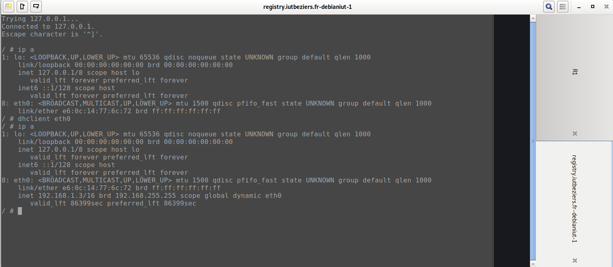

#  SAE 21

## DHCP

Lors de cette SAE j'ai pu m'occuper du serveur dhcp , je me suis donc d'abord renseigner sur la fonctionnalité du dhcp avec plusieurs forum et site internet.

Je me suis donc lancer dans la configuration du dhcp avec ce que j'avais pu lire sur les forums.

J'ai donc fait ma premiere configuration.

Enfin j'ai branché un PC pour faire le test et mon dhcp fonctionne bien .

## Apache2

Pour la suite de cette SAE j'ai pu fair ele serveur web externe
j'ai donc utliser les commande suivantes : 

    apt-get purge apache2

    apt-get install apache2

    cd var/www/html/

    nano index.html 

    rm -r index.html 

    nano index.html

    nano style.css

dans le fichier index.html je met donc mon code pour le site , et créer un fichier css .

J'ai ensuite modifier le fichier host.

Enfin nous pouvons voir le site en tapant l'addresse ip du PC qui sert de serveur.

J'ai ensuite voulu essayer de faire le site en virtuel mais je n'ai pas reussi a installer la machine virtuelle sur GNS3 pour créer le site.

## DNS 

Enfin pour la parti sur le DNS je me suis beaucoup renseigner sur des forums.

Pour la configuration j'ai donc utiliser les fichier :

        resolv.conf
        named.conf.options
        named.conf.local
        
et créer le fichier :

        db.cischool

Dans le resolv.conf je supprime tout et ajoute:

        search cischool
        nameserver 10.213.9.1
        
Dans le named.conf.options j'ajoute :

        forwarders{8.8.8.8;};
        listen-on-v6 {::1;};
        
        
Dans le named.conf.local j'ajoute la zone:
        
        zone "cischool"{
        type master;
        file "/etc/bind/db.cischool"
        }

