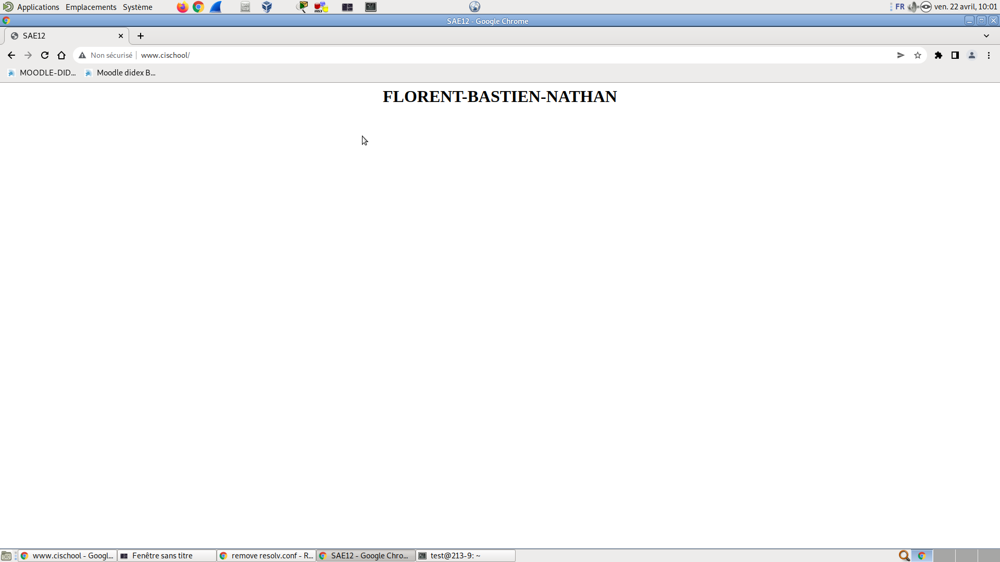

#  SAE 21

Tout d'abord, lors des premières séances, j'ai commencé à me renseigner sur les différents points qui m'étaient attribués. Je me suis donc intéressé à plusieurs forums, sites internet, videos... pour m'aider à la compréhension et à l'utilisation de mes tâches. 

## DHCP

Lors de cette SAE, j'ai pu apprendre à découvrir le fonctionnement du serveur dhcp, je me suis donc d'abord intéressé à des vidéos portant sur la fonctionnalité du dhcp.

Après ces différentes lectures et découvertes sur les forums, je me suis donc lancé dans la configuration du dhcp.

J'ai alors fait ma première configuration.

Enfin, j'ai branché un PC pour faire le test et mon dhcp fonctionnait bien .

## DNS 

Puis, pour la partie sur le DNS j'ai suivi la même démarche en accentuant mes recherches sur les forums.

Pour la configuration, j'ai donc utilisé les fichiers :

        resolv.conf
        named.conf.options
        named.conf.local
        
et j'ai créé le fichier :

        db.cischool

Dans le resolv.conf, j'ai supprimé tout et j'ai ajouté:

        search cischool
        nameserver 10.213.9.1
        
Dans le named.conf.options j'ai ajouté :

        forwarders{8.8.8.8;};
        listen-on-v6 {::1;};
        
        
Dans le named.conf.local j'ai ajouté la zone:
        
        zone "cischool"{
        type master;
        file "/etc/bind/db.cischool"
        }

Nous pouvons ensuite voir avec la commande dig que le dns fonctionne bien 

Enfin dans la barre de recherche en tapant http://www.cischool nous trouvons bien le site créé 

## Apache2

Pour la suite de cette SAE, j'ai pu faire le serveur web externe
J'ai donc utilisé les commandes suivantes : 

    apt-get purge apache2

    apt-get install apache2

    cd var/www/html/

    nano index.html 

    rm -r index.html 

    nano index.html

    nano style.css

Dans le fichier index.html j'ai mis donc mon code pour le site , et j'ai créé un fichier css .

J'ai ensuite modifié le fichier host.

Enfin, nous pouvons voir le site en tapant l'adresse IP du PC, qui sert de serveur.

J'ai alors voulu essayer de faire le site en virtuel mais je n'ai pas reussi à installer la machine virtuelle sur GNS3 pour créer le site.

